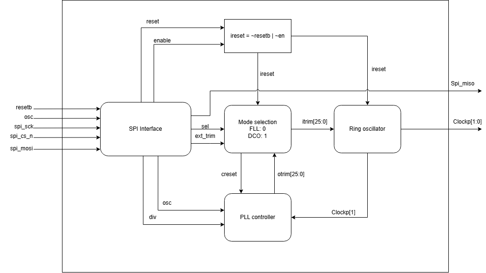
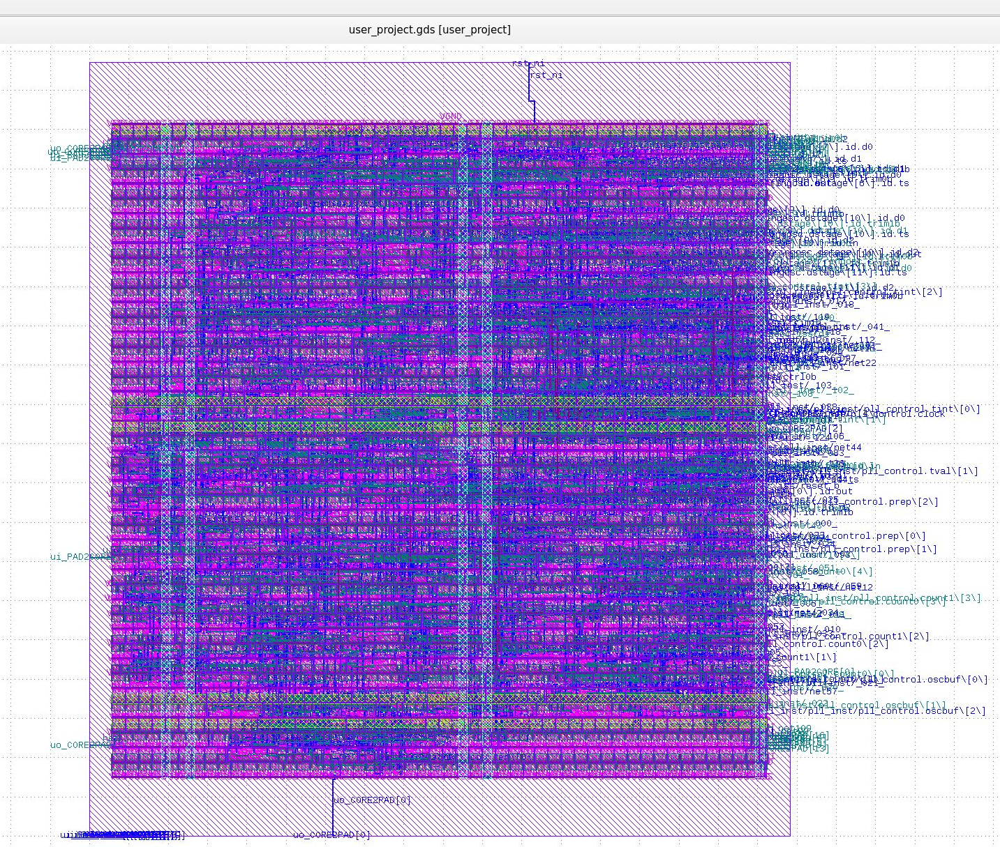
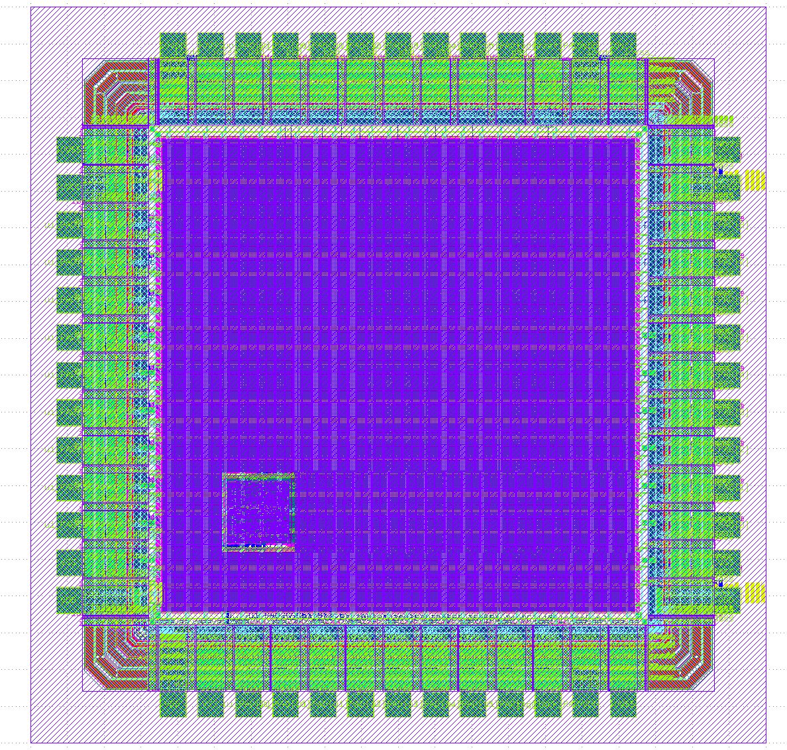

## Description
The RTL for this project is inherited and developed based on the Digital PLL module from **Efabless Caravel**.

> **[Efabless Caravel](https://github.com/efabless/caravel):** Caravel is a standard SoC template with on-chip resources to control and read/write operations from a user-dedicated space.

we also created a new spi protocol wrapper to decrease the numbers of input pins.

## Architecture

### Architecture Diagram

## Layout Result (GDS View) before integrated pad ring

## Layout Result (GDS View) after integrated pad ring

